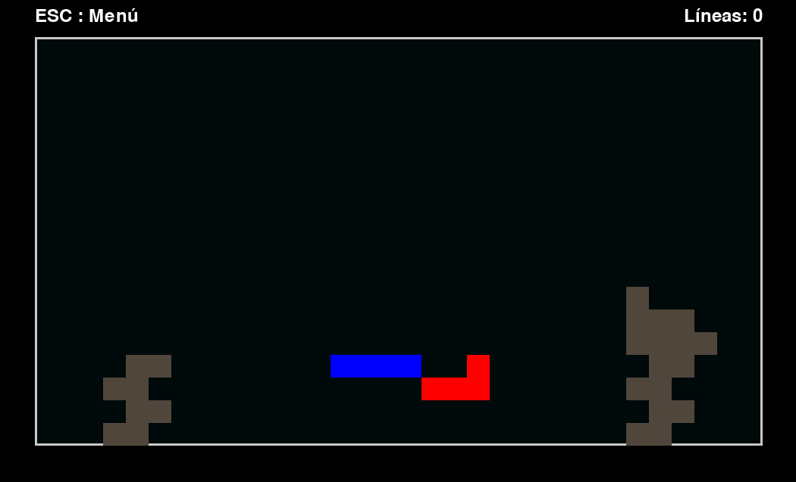

# Tetris Cooperativo

Un juego clásico de Tetris cooperativo desarrollado con Python y Pygame, diseñado para dos jugadores, con una interfaz moderna y personalizada.

---

## Características principales

- **Modo cooperativo**: Dos jugadores pueden jugar al mismo tiempo, con controles individuales para cada jugador.
- **Interfaz personalizable**: Incluye un menú principal con diseño moderno y un fondo dinámico.
- **Adaptabilidad**: El juego se ajusta al tamaño de la ventana.
- **Estadísticas**: Muestra un contador de líneas eliminadas.

---

## Requisitos del sistema

- Python 3.8 o superior.
- Pygame 2.0 o superior.

---

## Instalación

1. **Clonar el repositorio**

   ```bash
   git clone https://github.com/tu_usuario/tetris-cooperativo.git
   cd tetris-cooperativo
   ```

2. **Instalar las dependencias**

   Asegúrate de tener Python instalado y ejecuta:

   ```bash
   pip install pygame
   ```

3. **Ejecutar el juego**

   ```bash
   python main.py
   ```

---

## Cómo jugar

### Controles

- **Jugador 1 (color azul)**:
  - **Mover a la izquierda**: Tecla `A`
  - **Mover a la derecha**: Tecla `D`
  - **Mover hacia abajo**: Tecla `S`
  - **Rotar pieza**: Tecla `W`

- **Jugador 2 (color rojo)**:
  - **Mover a la izquierda**: Flecha `←`
  - **Mover a la derecha**: Flecha `→`
  - **Mover hacia abajo**: Flecha `↓`
  - **Rotar pieza**: Flecha `↑`

### Objetivo

- Completar líneas horizontales eliminando las filas completas del tablero.
- Trabajar en equipo para alcanzar el puntaje más alto.
- Evitar que las piezas se acumulen hasta la parte superior del tablero.

### Menú principal

- **Enter para jugar**: Comienza una nueva partida.
- **Esc para salir**: Cierra el juego.

### Game Over

Si las piezas alcanzan la parte superior del tablero, el juego termina. Podrás elegir entre:
- **Reintentar**: Empezar una nueva partida.
- **Menú principal**: Regresar al menú principal.

---

## Personalización

1. **Colores y diseño**:
   - Puedes cambiar los colores de las piezas, el tablero o el fondo editando los valores en `main.py`.

2. **Imagen de fondo**:
   - Sustituye la imagen en `./assets/tetris_background.jpg` para personalizar el fondo del menú principal.

3. **Velocidades del juego**:
   - Ajusta las constantes `SPEED_LEFT`, `SPEED_RIGHT`, `SPEED_DOWN` y `SPEED_ROTATE` para modificar la velocidad de movimiento y rotación de las piezas.

---

## Capturas de pantalla

### Menú principal


### Juego en acción


---

## Contribuciones

¡Las contribuciones son bienvenidas! Por favor, sigue estos pasos:

1. Haz un fork del repositorio.
2. Crea una rama nueva para tu función o corrección: `git checkout -b mi-nueva-funcion`.
3. Realiza tus cambios y haz un commit: `git commit -m 'Agregada nueva función'`.
4. Haz push a tu rama: `git push origin mi-nueva-funcion`.
5. Abre un Pull Request.

---

## Licencia

Este proyecto está bajo la licencia MIT. Consulta el archivo [LICENSE](./LICENSE) para más detalles.

---

## Créditos

- Diseño y desarrollo: [vlasvlasvlas](https://github.com/vlasvlasvlas)
- Basado en el juego de Tetris Classic modo colaborativo.